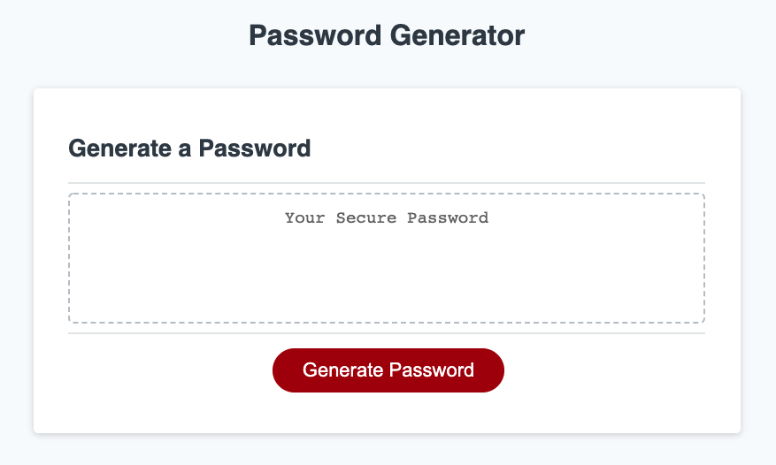
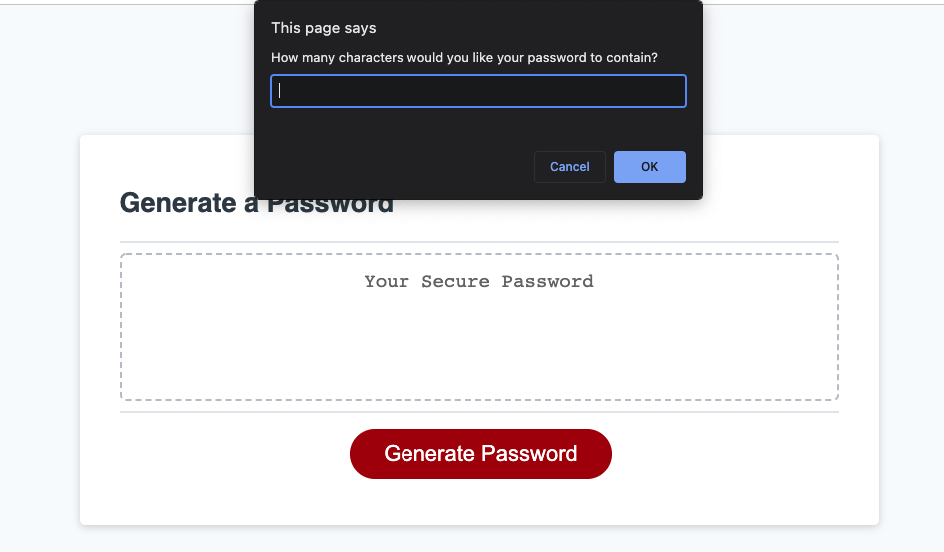
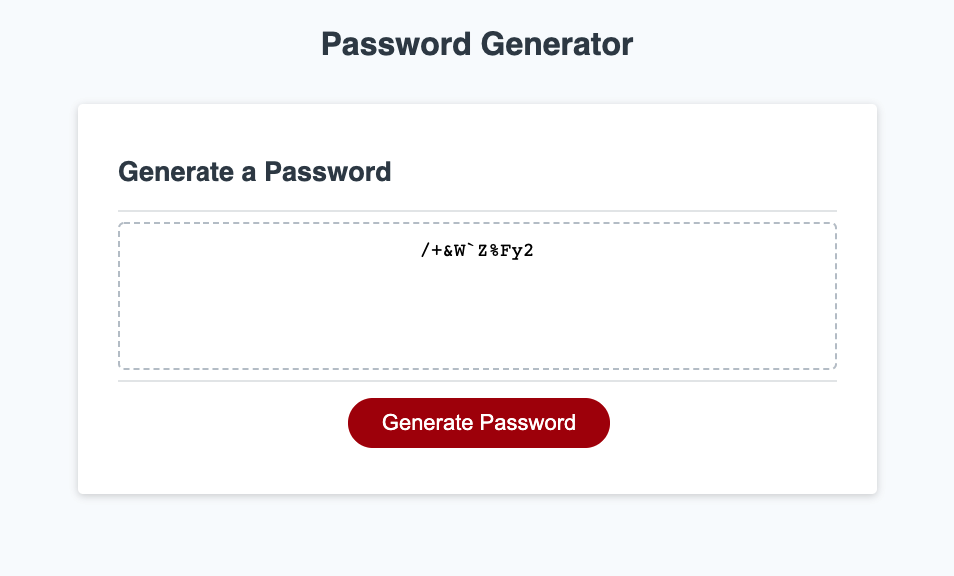

# Password Generator - JavaScript Project

## Link
Please click the following link to find the deployed project:


## Table of Contents

- [Link](#link)
- [Description](#description)
- [Usage](#usage)
- [Technology](#technology)
- [Assets](#assets)
- [Credits](#credits)


## Description

Welcome to the Password Generator application page!

This is a webpage to help generating a random password based on criterias that the user selects. In this page, you will see some pop-ups windows regarding 4 different character types (lowercase, uppercase, numeric, and special characters). User will need to confirm whether to include them in the password. User will also be asking how many characters the password should contain.

The main purpose of this project is to practise my skills in For Loop, generating random characters, the use of variables, arrays, and functions in JavaScript.


## Usage
Please follow the steps below to generate a random password:
- Click on "Generate Password"
- Answer questions display in the pop-ups windows
- A random password based on criterias that you’ve selected is generated 🎉


## Technology

```md
- JavaScript
- HTML (provided in the starter code)
- CSS (provided in the starter code)
```

## Assets

The following images demonstrate the web application's appearance and functionality:






---
## Credits
Original source code is from The Coding Boot Camp | UC San Diego Extension

Trilogy Education Services, LLC 🏆 

